### 

> **See where your gold is going and coming from!**

## Overview

**MyAccountant** is a World of Warcraft Addon that helps track where your money is going with powerful customization options.

Heavily inspired by AccountantClassic, see a detailed breakdown by source or zone across any timeframe you choose. Whether you're farming gold, managing your auction house empire, or simply curious about your spending habits, see exactly where your money is moving!

**MyAccountant** currently supports all versions of WoW.

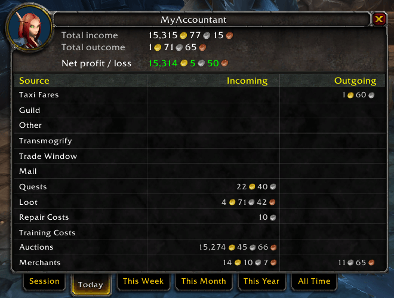

## Features

### **See your gold per hour**

Track your gold per hour on the configurable minimap icon

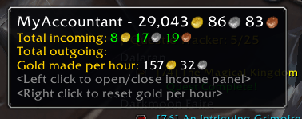

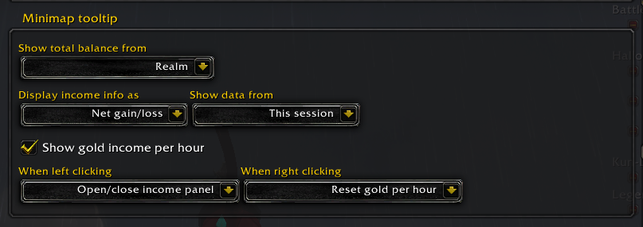

### **See your income**

The configurable income panel allows you to see where your money is coming and going from, showing you a session or historic breakdown.

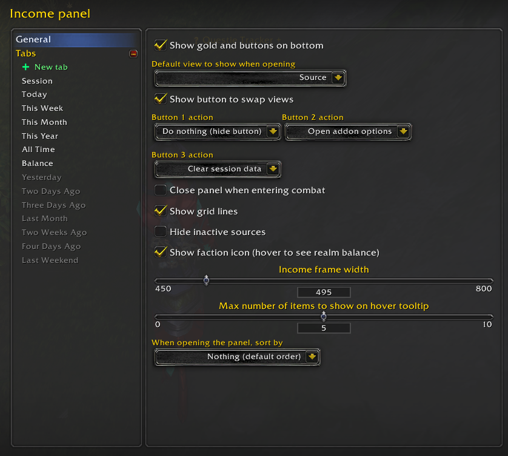

**See it by source**

**Or by zone**

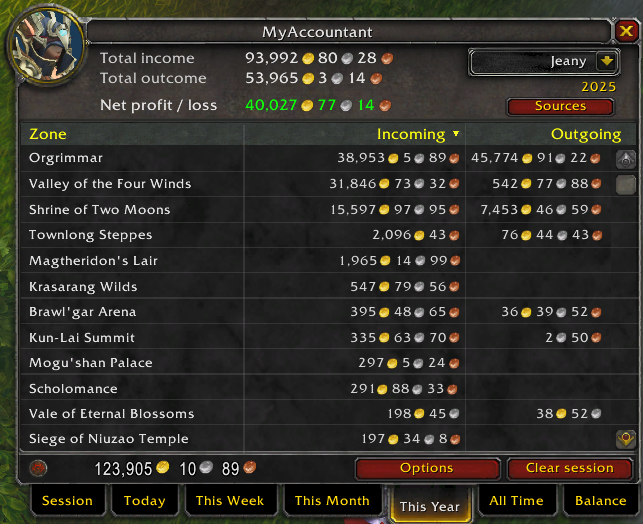

Mouse over an income or outcome to see a breakdown. Configurable in options.

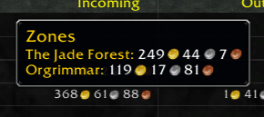

### **Configure your tabs**

Set which tabs you want to see and in which order.

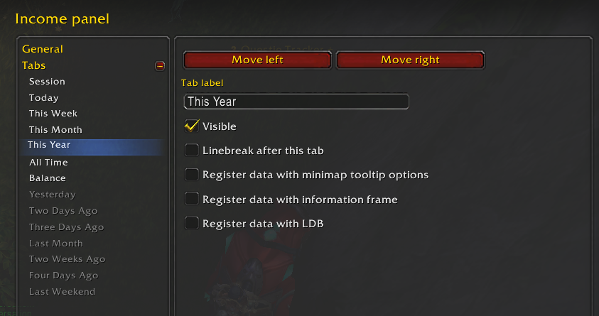

Advanced mode allows you to add your own tabs and configure them with lua snippets, specifying the exact date range you want to see.

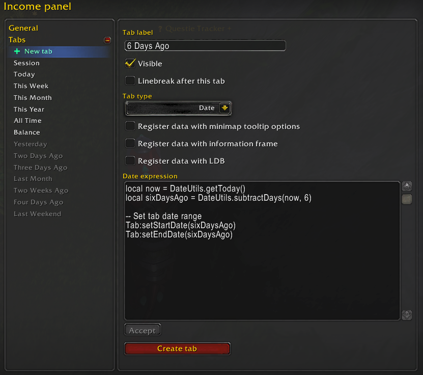

📚 **[Learn how to create custom tabs with our comprehensive API documentation →](API/CustomTabs.md)**

### **See all your characters**

Track your income as a whole or by each of your characters.

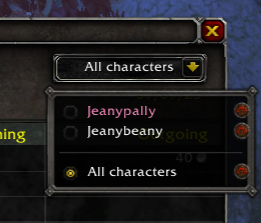

### **See what you want on the information frame**

MyAccountant can display a small information frame containing income data. Configure it in Addon options to show what you want to see.

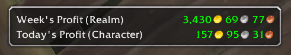

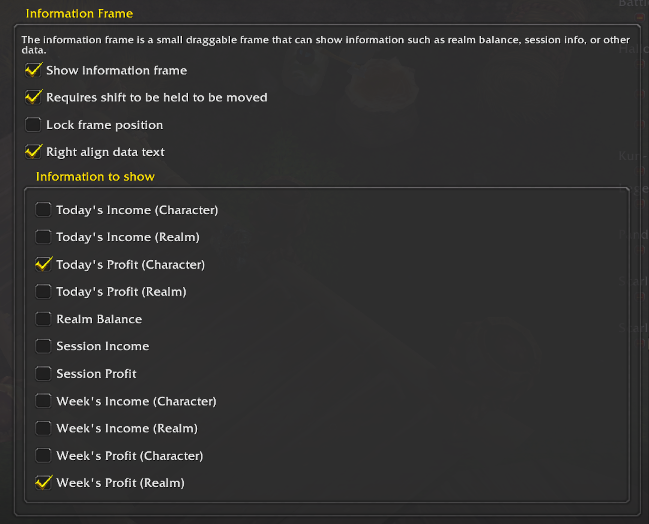

### **See your balance**

MyAccountant tracks your gold balance across your Warband and all your characters on your realm and offers several ways to show that information. You can turn off unwanted display methods in Addon options.

#### Faction icon

Hover over the faction icon to see your realm's total balance.

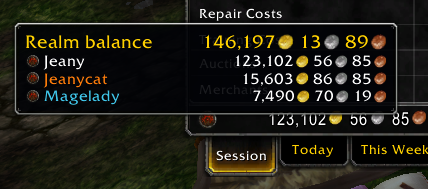

#### Balance tab

Use the balance tab on the income panel. You can disable this in tab configuration.

#### Information panel

You can also configure the information panel to show realm balance.

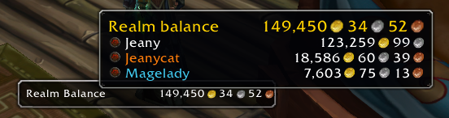

### **LibDataBroker support**

MyAccountant registers data from tabs with **LDB (Lib Data Broker)**. You can specify which tabs send LDB data in tab configuration.

This lets you see MyAccountant information in any addon that supports showing LDB data like Titan Panel or Bazooka.

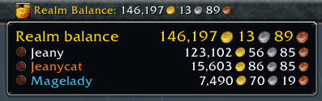

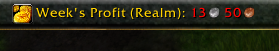

### **Sort by what you want**

Configure the income panel to either sort when opening, or click on a table header to sort either by descending or ascending.

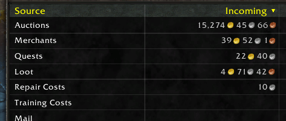

### **Supports all WoW versions**

MyAccountant knows which sources are unavailable in each version of WoW. This lets this addon work on Mists Classic, Vanilla, or Retail.

### **Configure your income sources**

Decide which income sources you want to track by disabling ones you aren't interested in

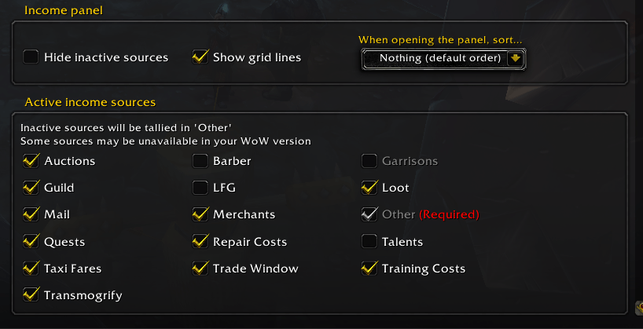

## How to install
### Curseforge (Recommended)
1. Search for "MyAccountant" in the CurseForge App
2. Click Install

### Manual
1. Download the [latest release](https://github.com/jeany55/MyAccountant/releases/latest) from the releases page.
2. Extract the zip file into your `Interface/Addons` folder (eg. `World of Warcraft/_retail/Interface/Addons/`)

## Supported languages
* <B>English</B>
* <B>Russian</B>&nbsp;(by ZamestoTV)
* <B>Simplified Chinese</B>&nbsp;(by cclolz)

## How to contribute

### Want to add a translation?

Make a copy of [Locales/TEMPLATE.lua](Locales/TEMPLATE.lua) and make the necessary changes for your translation.

Then either open up a PR with your change, or create an issue if you're unsure how to complete a merge (and we can do it for you!)

### Want a new feature?

Have an idea for a new feature? [Create an issue](https://github.com/jeany55/MyAccountant/issues/new) describing what you would like to see!

Or, if you're feeling brave you can make the change yourself and submit a pull request! Increasing versions in the toc is not necessary, it's done automatically as part of the release Github Action.

### Find a bug?

Please [open a issue](https://github.com/jeany55/MyAccountant/issues/new) on the issues page!

## Special thanks
* Quetz

## License
MIT, see the [License](LICENSE) file.

---

  
**Made with ❤️ for the World of Warcraft community**

If you find MyAccountant helpful, consider leaving a ⭐ on [GitHub](https://github.com/jeany55/MyAccountant) or a review on [CurseForge](https://www.curseforge.com/wow/addons/myaccountant)!

