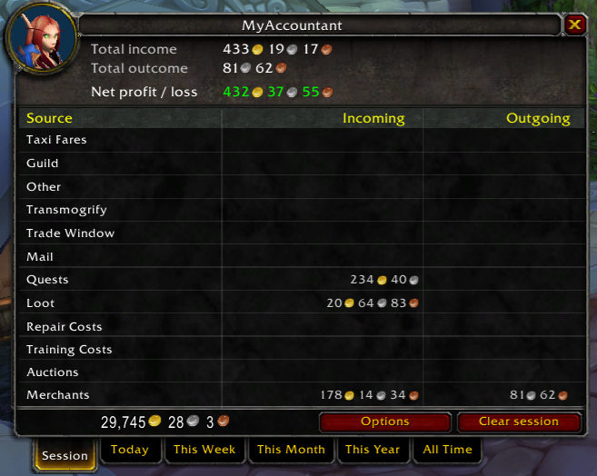

# MyAccountant

**MyAccountant** is a World of Warcraft Addon that helps track where your money is going.

Heavily inspired by AccountantClassic, see a breakdown by source or zone - either by session, day, week, month, year, or all time. MyAccountant currently supports all versions of WoW.

## Features

### **See your gold per hour**

Track your gold per hour on the configurable minimap icon

### **See your income**

A configurable income panel allows you to see where your money is coming and going from, showing you a session or historic breakdown.

**See it by source**

**Or by zone**

Mouse over an income or outcome to see a breakdown. Configurable in options.

### **See all your characters**

Track your income as a whole or by each of your characters.

See your realm's balance by hovering over the faction icon.

### **LibDataBroker support**

MyAccountant registers realm balance, session income and profit, today's income and profit, and the week's income and profit with **LDB (Lib Data Broker)**.

This lets you to see MyAccountant information in any addon that supports showing LDB data (eg. Titan Panel, Bazooka).

### **Sort by what you want**

Configure the income panel to either sort when opening, or click on a table header to sort either by descending or ascending.

### **Supports all WoW versions**

MyAccountant knows which sources are unavailable in each version of WoW. This lets this addon work on Mists Classic, Vanilla, or Retail.

### **Configure your income sources**

Decide which income sources you want to track by disabling ones you aren't interested in

## Supported languages
* <B>English</B>
* <B>Russian</B>&nbsp;(by ZamestoTV)

## How to contribute

### Want to add a translation?

Make a copy of [Locales/TEMPLATE.lua](Locales/TEMPLATE.lua) and make the necessary changes for your translation.

Then either open up a PR with your change, or create an issue if you're unsure how to complete a merge (and we can do it for you!)

### Want a new feature?

Create an issue describing what you would like to see.

Or, if you're feeling brave you can make the change yourself and submit a pull request! Increasing versions in the toc is not necessary, it's done automatically as part of the release Github Action.

### Find a bug?

Please open a issue on the issues page!

## License
MIT, see the [License](LICENSE) file.
