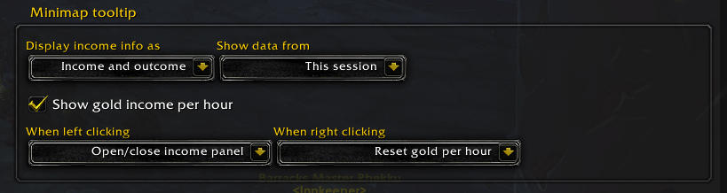
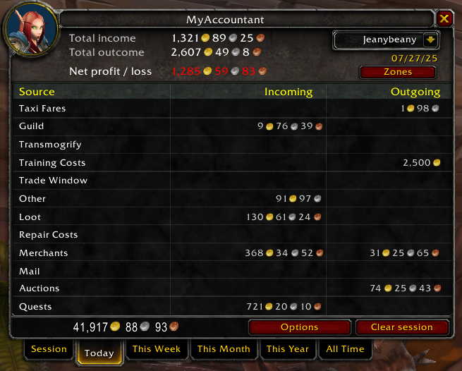
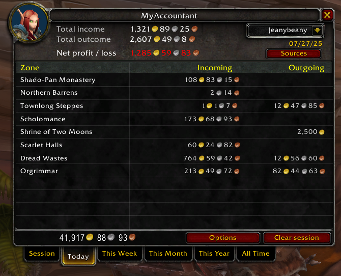

# 

> **Track your World of Warcraft gold with precision and style!**

## 📋 Table of Contents

- [Overview](#overview)
- [Installation](#installation)
- [Quick Start](#quick-start)
- [Features](#features)
- [Supported Versions](#supported-versions)
- [Supported Languages](#supported-languages)
- [Contributing](#contributing)
- [License](#license)

## Overview

**MyAccountant** is a comprehensive World of Warcraft addon that helps you track where your money is coming from and going to, showing you exactly what you want to see with powerful customization options.

Heavily inspired by AccountantClassic, MyAccountant lets you view detailed breakdowns by source or zone across any timeframe you choose. Whether you're farming gold, managing your auction house empire, or simply curious about your spending habits, MyAccountant provides the insights you need.

**Key Highlights:**
- 📊 Track gold per hour in real-time
- 🗺️ View income/expenses by source or zone
- 👥 Monitor all your characters across your realm
- ⚙️ Highly customizable tabs and displays
- 🔌 LibDataBroker support for Titan Panel, Bazooka, and more
- 🌍 Works on all WoW versions (Classic, Wrath, Cata, Mists, Retail)

## Installation

### From CurseForge (Recommended)
1. Install the [CurseForge App](https://www.curseforge.com/download/app)
2. Search for "MyAccountant" in the app
3. Click Install

### Manual Installation
1. Download the latest release from [GitHub Releases](https://github.com/jeany55/MyAccountant/releases/latest)
2. Extract the zip file
3. Copy the `MyAccountant` folder to your `World of Warcraft/_retail_/Interface/AddOns/` directory
   - For Classic: `World of Warcraft/_classic_/Interface/AddOns/`
   - For Wrath: `World of Warcraft/_wrath_/Interface/AddOns/`
   - For Cata: `World of Warcraft/_cata_/Interface/AddOns/`
4. Restart World of Warcraft

## Quick Start

Once installed, MyAccountant automatically starts tracking your gold transactions.

**Access the addon:**
- Click the minimap icon to open the income panel
- Type `/myaccountant` or `/ma` in chat to open settings
- Configure minimap icon in addon options: `/ma minimap`

**First-time setup:**
1. Open addon options with `/ma`
2. Configure which tabs you want to see
3. Set up your preferred timeframes (Session, Today, Week, etc.)
4. Enable/disable income sources based on what you want to track

## Features

### 💰 See Your Gold Per Hour

Track your gold per hour on the configurable minimap icon:

### 📈 See Your Income

The configurable income panel allows you to see where your money is coming from and going to, showing you a session or historic breakdown:

**See it by source**

**Or by zone**

Mouse over any income or expense entry to see a detailed breakdown (configurable in options):

### ⚙️ Configure Your Tabs

Set which tabs you want to see and in which order:

Advanced mode allows you to add your own custom tabs and configure them with Lua snippets, specifying the exact date range you want to see:

### 👥 See All Your Characters

Track your income as a whole or by each of your individual characters:

### 📊 Customize the Information Frame

MyAccountant can display a small information frame containing income data. Configure it in the addon options to show exactly what you want to see:

### 💎 Track Your Balance

MyAccountant tracks your gold balance across all your characters on your realm and offers several ways to display that information. You can enable or disable each display method in the addon options:

#### Faction Icon

Hover over the faction icon to see your realm's total balance:

#### Balance Tab

Use the balance tab on the income panel:

#### Information Panel

You can also configure the information panel to show realm balance:

### 🔌 LibDataBroker Support

MyAccountant registers data from tabs with **LDB (LibDataBroker)**. You can specify which tabs send LDB data in the tab configuration.

This allows you to view MyAccountant information in any addon that supports displaying LDB data, such as Titan Panel or Bazooka:

### 🔢 Sort By What You Want

Configure the income panel to sort automatically when opening, or click on any table header to sort by that column in ascending or descending order:

### 🎮 Multi-Version Support

MyAccountant intelligently adapts to each version of WoW, automatically disabling sources that are unavailable in specific versions. This ensures seamless compatibility across all game versions.

### 🎯 Configure Your Income Sources

Customize which income sources you want to track by enabling or disabling specific ones based on your interests:

## Supported Versions

MyAccountant works seamlessly across all World of Warcraft versions:

- ✅ **Retail** (The War Within and beyond)
- ✅ **Cataclysm Classic**
- ✅ **Mists of Pandaria Classic**
- ✅ **Wrath of the Lich King Classic**
- ✅ **Classic Era** (Vanilla)

## Supported Languages

* 🇬🇧 **English**
* 🇷🇺 **Russian** (by ZamestoTV)
* 🇨🇳 **Simplified Chinese** (by cclolz)

## Contributing

We welcome contributions from the community! Here's how you can help:

### 🌍 Add a Translation

1. Make a copy of [Locales/TEMPLATE.lua](Locales/TEMPLATE.lua)
2. Translate the strings to your language
3. Open a pull request with your changes, or create an issue if you need help with the merge

### ✨ Request a Feature

Have an idea for a new feature? [Create an issue](https://github.com/jeany55/MyAccountant/issues/new) describing what you'd like to see.

Or, if you're comfortable with Lua, feel free to implement it yourself and submit a pull request! 

**Note:** You don't need to update version numbers in the `.toc` files—this is handled automatically by our release workflow.

### 🐛 Report a Bug

Found a bug? Please [open an issue](https://github.com/jeany55/MyAccountant/issues/new) with:
- A clear description of the problem
- Steps to reproduce
- Your WoW version
- Any error messages from the game (use `/console scriptErrors 1` to enable them)

## License

This project is licensed under the MIT License - see the [LICENSE](LICENSE) file for details.

---

**Made with ❤️ for the World of Warcraft community**

If you find MyAccountant helpful, consider leaving a ⭐ on [GitHub](https://github.com/jeany55/MyAccountant) or a review on [CurseForge](https://www.curseforge.com/wow/addons/myaccountant)!

